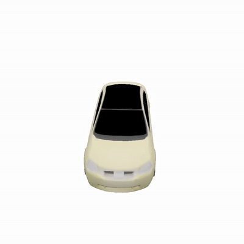

# Texture Fields
<div style="text-align: center">


</div>

This repository contains code for the paper 'Texture Fields: Learning Texture Representations in Function Space'.

You can find detailed usage instructions for training your own models and using pretrained models below.

If you find our code or paper useful, please consider citing

    @inproceedings{OechsleICCV2019,
        title = {Texture Fields: Learning Texture Representations in Function Space},
        author = {Oechsle, Michael and Mescheder,Lars and Niemeyer, Michael and Strauss, Thilo and Geiger, Andreas},
        booktitle = {Proceedings IEEE International Conf. on Computer Vision (ICCV)},
        year = {2019}
    }

## Installation
The simplest way to run our implementation is to use [anaconda](https://www.anaconda.com/). 

You can create an anaconda environment called `texturefields` with
```
conda env create -f environment.yaml
conda activate texturefields
```

## Demo

If you just want to quickly test our method on the single view reconstruction task, you can run our demo with 
```
python generate.py configs/singleview/texfields/car_demo.yaml 
```

The script is using a pre-trained model for reconstructing the texture of the car object provided in `data/demo/`. You can find predicted images in `out/demo/fake/`.

## Dataset
For downloading the preprocessed data, run the following script. 
```
source ./scripts/download_data.sh
```
We just provide data for the car category with a file size of 33 GB.
The dataset is copied to the `data/` folder. For each 3D object we have 17 input views, 10 random views with corresponding depth maps and camera information. The train, test and validation splits are located in the main sub folder of the categories. For visualization, we provide renderings from fixed views in th `visualize` subfolder.
Data structure:
____
data/shapenet/data_cars/{ModelID}/\
&nbsp;&nbsp;&nbsp;&nbsp; input_image/ \
&nbsp;&nbsp;&nbsp;&nbsp; image/\
&nbsp;&nbsp;&nbsp;&nbsp; depth/\
&nbsp;&nbsp;&nbsp;&nbsp; visualize/\
&nbsp;&nbsp;&nbsp;&nbsp;&nbsp;&nbsp;&nbsp;&nbsp; image/\
&nbsp;&nbsp;&nbsp;&nbsp;&nbsp;&nbsp;&nbsp;&nbsp; depth/\
&nbsp;&nbsp;&nbsp;&nbsp; pointcloud.npz
____

## Usage
You can use our implementation for training, generation and evaluation. For each mode there is a corresponding file that needs to be run. 

### Generation
#### Single View Texture Reconstruction
For testing our method, you can generate novel views by running
```
python generate.py CONFIG.yaml
```
CONFIG.yaml stands for the path to a config file.
For generation, you can choose whether the views are from random views or fixed views on a circle around the object. If you would like to use random views you can add to the config file
```
test:
  dataset_split: 'test_eval' 
 ```
to the config file. For evaluating fixed views, you can replace the option with `'test_vis'`.
For the evaluation we use the random views.
Example of config files can be found in
```
configs/singleview/car.yaml
configs/singleview/car_eval_rnd.yaml
```

#### Generative Model
You can run our generative models by executing
```
python generate.py configs/VAE/000_eval_fix.yaml
```
for the GAN
```
python generate.py configs/GAN/000_eval_fix.yaml
```
for predicting novel texture in
```
out/VAE/car/eval_fix/
out/GAN/car/eval_fix/
```

### Evaluation
You can evaluate the performance of our method on the single view reconstruction task by running
```
python generate.py configs/singleview/car_eval_rnd.yaml
python evaluate.py configs/singleview/car_eval_rnd.yaml
```
The script writes the results into the respective output folder.
```
out/singleview/car/eval_rnd/
```

### Training
For training a model from scratch run 
```
python train.py CONFIG.yaml
```
in the conda environement.
Please set the following option in the config file:
```
model:
  model_url:
```
So that pre-trained model are not loaded.
The training process can be visualized with tensorboard. The logfiles are saved to the `logs` folder in the output directory.
```
tensorboard --logdir ./out --port 6006
```